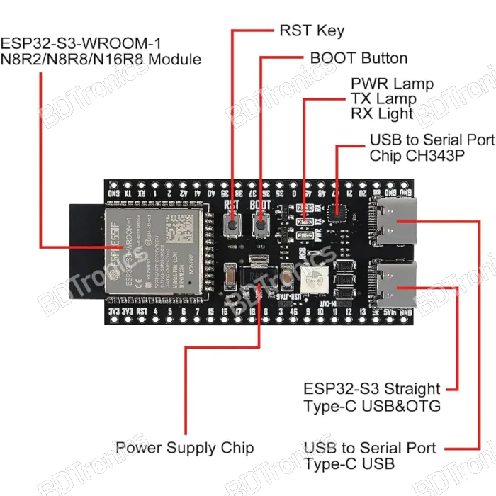
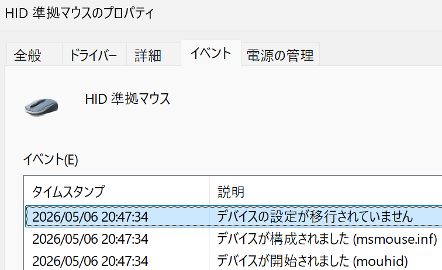

# esp32-wakeup-sleep

ESP32-S3 向けの USB Remote Wake 最小ライブラリです。
- 必要要件
  - USB-OTG(Tiny USB) があるボード
  - ESP32-S3-WROOM-1で動作確認済

## Arduino IDE で使う（推奨）

1. リポジトリ直下の `esp32-wakeup-sleep-arduino-min.zip` をダウンロードします。
2. Arduino IDE で `スケッチ > ライブラリをインクルード > .ZIP形式のライブラリをインストール` を選び、上の zip を指定します。
3. この方法なら移動作業は不要です（IDE が `Documents/Arduino/libraries` に配置します）。
4. 手動で展開する場合は、展開先を `Documents/Arduino/libraries/esp32-wakeup-sleep` にします。
5. `ファイル > スケッチ例 > ESP32WakeCore > minimal` を開きます。
6. `minimal.ino` の `appSetup() / appLoop() / appOnWakeButton()` を編集して使います。
7. PCとHIDを有線接続 

OTGじゃない方です
  

8. 使っているボードに変更（例：`Fri3d Badge 2024 (ESP32-S3-WROOM-1)`）
9. USB-ModeをUSB-OTG(Tiny USB)に変更 

設定はこちら
  

10. ボードマネージャー `esp32` (Arduinoじゃない方）
11. 必要なライブラリは適宜インストール
12. 書き込み
13. OTGに接続
14. Windows STARTボタンを右クリック＞デバイスマネージャー＞マウスとそのほかのポインティングデバイス＞HID準拠マウス＞プロパティ 

イベントのタイムスタンプを確認
 書き込んだ時間になっているはずです．  

14. `minimal.ino`は，BOOTボタンを押すとスリープから復帰します．

## 配布 zip の中身

- `library.properties`
- `src/wake_core.h`
- `src/wake_core.c`
- `examples/minimal/minimal.ino`

## まず触る場所（minimal.ino）

- 起動時処理: `appSetup()`
- 通常ループ: `appLoop()`
- BOOT押下で wake 要求後の処理: `appOnWakeButton(bool wakeSent)`

`setup()` / `loop()` 側には、USB HID と Remote Wake の最低限の土台だけを残しています。

## 動作確認できたらFireBase（minimal_firebase_wake.ino）
FireBaseのリアルタイムデータベースを用いて，VPNなしで外出先からスリープ復帰可能

Firebase Console側の作成から `/wake/request` とルール設定までの手順は [FireBase 設定方法.md](docs/FireBase%20設定方法.md) を参照してください。

- AP mode (Wi-Fi setup mode)
  - SSID: ESP32-Wake-Setup
  - Password: esp32setup
  - URL: http://192.168.4.1/ または http://esp32-wake.local/

| 入力項目 | 内容 |
| - | - |
| Wi-Fi SSID | YOUR_WI-FI_SSID |
| Wi-Fi Pass | YOUR_WI-FI_PASS |
| FireBase API | YOUR_API |
| FireBase URL | YOUR_URL |
| Username (email) | YOUR_EMAIL |
| Pass | YOUR_PASS |
  

## Public API

- `esp_err_t wake_init(void);`
- `void wake_usb_on_suspend(bool remote_wakeup_en);`
- `void wake_usb_on_resume(void);`
- `uint32_t wake_usb_get_suspend_seq(void);`
- `wake_state_t wake_get_state(void);`
- `bool wake_trigger(void);`

## 補足

- `idf_boot_button_wake_test/` や `tools/` は、Arduino 最小運用には不要です。
- `minimal.io` ではなく `minimal.ino` が正しいファイル名です。
